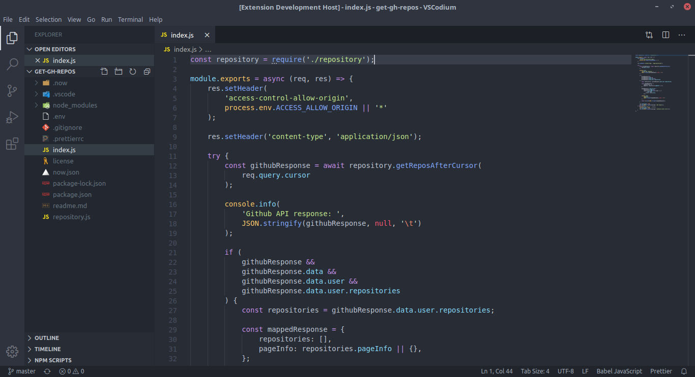
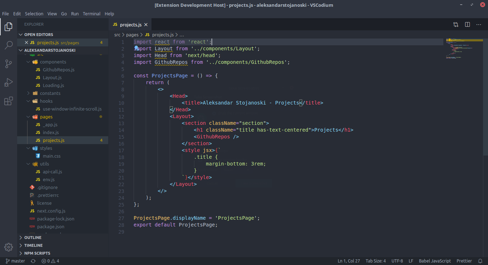

# Ace Palenight

[](https://marketplace.visualstudio.com/items?itemName=acestojanoski.ace-palenight)
[](https://marketplace.visualstudio.com/items?itemName=acestojanoski.ace-palenight)

> Visual Studio Code theme, based on [Palenight](https://github.com/whizkydee/vscode-palenight-theme), and [Subliminal](https://github.com/gaearon/subliminal).

Pull requests are welcome.

## Content

* [Screenshots](#screenshots)
* [Preferred Settings](#preferred-settings)
* [Credits](#credits)
* [Changelog](changelog.md)
* [Licence](#license)

## Screenshots




## Preferred Settings
Add this configuration to your VS Code `settings.json` file:

```json
"editor.fontSize": 16,
"editor.folding": true,
"editor.hideCursorInOverviewRuler": true,
"editor.lineHeight": 26,
"editor.lineNumbers": "on",
"editor.minimap.enabled": false,
"editor.occurrencesHighlight": false,
"editor.overviewRulerBorder": false,
"editor.renderIndentGuides": false,
"explorer.openEditors.visible": 0,
"window.zoomLevel": 0,
"workbench.activityBar.visible": false,
"workbench.editor.showIcons": false,
"workbench.statusBar.visible": true,
"breadcrumbs.enabled": false,
"window.menuBarVisibility": "toggle",
```

## Credits
* Thanks to [whizkydee](https://github.com/whizkydee) for the beautiful [Palenight Theme](https://github.com/whizkydee/vscode-palenight-theme) theme, which I used for the [`tokenColors`](https://code.visualstudio.com/api/extension-guides/color-theme) (font coloring). 
* Thanks to [gaearon](https://github.com/gaearon) for the beautiful [Subliminal](https://github.com/gaearon/subliminal) theme, which I used for the base editor colors.

## License
[MIT](license)
